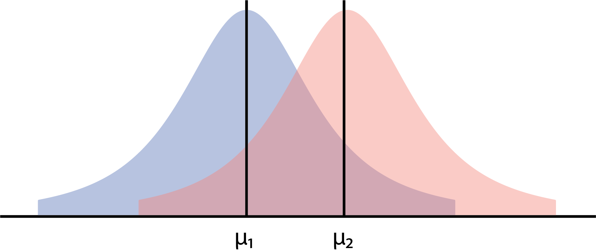
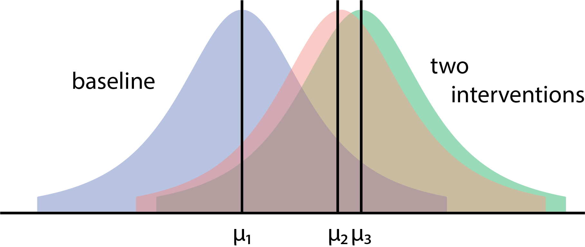
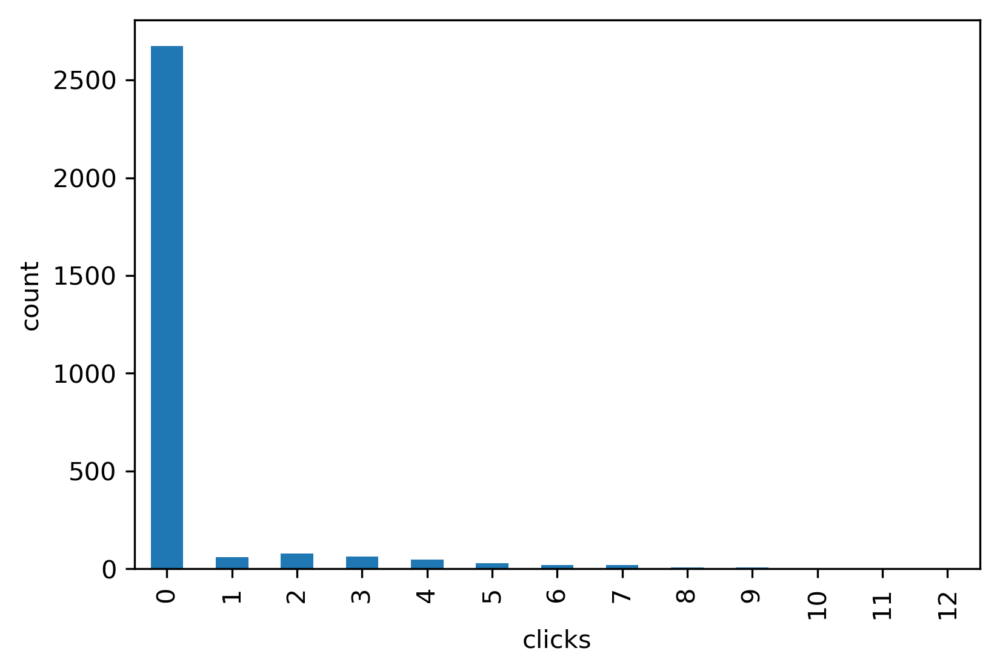
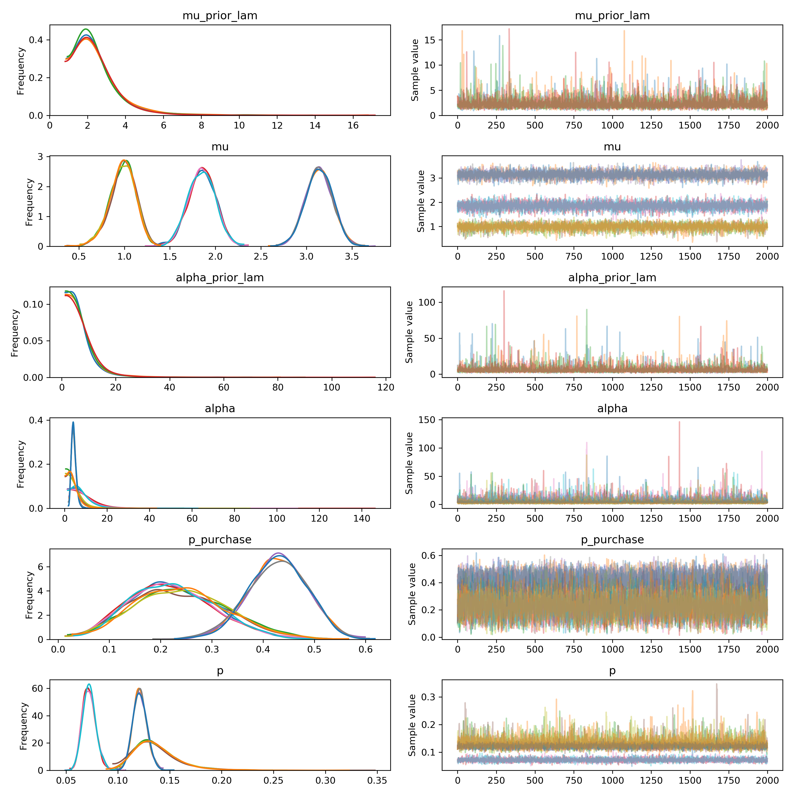

# Generalized Bayesian A/B[/C/D/E...] Testing

Speaker: Eric J. Ma
Affiliation: Novartis Institutes for Biomedical Research

## About Me

3 logos:

- MIT
- Novartis
- Python

## QR Code & URL

<!-- Put QR code here. Include QR code generator as part of Travis build script. -->

## Take-Home Messages

- You can do comparisons beyond just group "A" and group "B". You can add groups "C", "D", "E" and more.
- Using a probabilistic programming language, such as PyMC3, lets you do this in a principled fashion with a wonderful API.

## Comparison is a cornerstone of scientific inquiry

<!-- Background should be Hans Rosling video clip. -->

> When I see a lonely number in a news report, it always triggers an alarm: ***What should this lonely number be compared to?*** (Hans Rosling, "Factfulness")

## Bayesian Estimation: Comparison of 2 Groups

<!-- What are you most used to seeing? T-test -->



Let's say we're measuring the effect of an intervention on IQ.

Business question at hand:

> Does the intervention work?

This gets translated into the following statistical inference question, which we set up as our proxy for answering business question:

> Given the data, **can we conclude that $\mu_{1}$ and $\mu_{2}$ different?**

You probably heard about the t-test. Let's make clear what the assumptions of the t-test are.

We:

- assume that one of the groups is a "baseline" or "null hypothesis" group
- assume that our data are t-distributed
- assume that our mean is normally distributed, by "something something CLT"
- make an unclear assumption about how our variance and degrees of freedom are distributed

If we make all of these assumptions plain and clear, we arrive at Bayesian estimation.

Let's very quickly look at the model + code.

### Code

```python
with pm.Model() as model:
    obs1 = pm.Data('obs1', df.query('group == 1').values)
    obs2 = pm.Data('obs2', df.query('group == 2').values)

    mu1 = pm.Normal('mu1', mu=0, sd=10)
    mu2 = pm.Normal('mu2', mu=0, sd=10)

    sigma1 = pm.HalfCauchy('sigma1')
    sigma2 = pm.HalfCauchy('sigma2')

    nu = pm.Exponential('nu', lam=1/29.)

    like1 = pm.StudentT('like1', mu=mu1, sigma=sigma1, nu=nu, observed=obs1)
    like2 = pm.StudentT('like2', mu=mu1, sigma=sigma1, nu=nu, observed=obs2)
```

In Bayesian estimation, we:

- estimate the parameters for each group, and then
- compare them.

There's no reason why we should stop at 2 groups.

## Bayesian Estimation: Extension to 3 Groups



```python
n_groups = ...
with pm.Model() as model:
    # Observations
    obs = pm.Data('observations', ...)

    # Model Parameters
    mu = pm.Normal('mu', mu=0, sd=10, shape=n_groups)
    sigma = pm.HalfCauchy('sigma', shape=n_groups)
    nu = pm.Exponential('nu', lam=1/29.)

    # Likelihood
    like = pm.StudentT(
        'like',
        mu=mu[df['groups']],
        sigma=sigma[df['groups']],
        nu=nu,
        observed=obs
    )
```

- **Point 1:** With Bayesian methods, we can go beyond two group comparisons.
- **Point 2:** With PyMC3, extending Bayesian estimation beyond two groups is trivial.

## Side Note: Flexibility

If our estimation problem didn't deal with continuous outputs, all we would have to do is to replace the likelihood with a different distribution.

<!-- Put figure here comparing the two -->

## Side Note: Multiple hypothesis correction

My tongue-in-cheek response: you only need it if you have a hypothesis you're trying to prove. Which should be never.

My more serious response: It's convoluted and difficult to understand, has its own set of assumptions which we may need to break. Let's just use a PPL which lets us be explicit with our assumptions.

## Click Data

We have run an experiment on our hotel bookings website, in which we decided to assign our customers to view a new interface that:

- Is not different from the original.
- Displays a pop-up that previews pictures of our partner hotel rooms.
- Ranks results by a new scoring function for hotel value for money.

Our customers are searching for flights, and we have collected the number of clicks that they have made before making their purchases.

A sample of the data looks like this:

```ipython
     experiment_group  clicks
4765             grp1       6
1901             ctrl       2
8912             grp2       2
3840             grp1       3
3341             grp1       6
7847             grp2       1
6515             grp2       2
8339             grp2       2
5579             grp1       1
5834             grp1       3
```

### Data Characteristics

Some characteristics of the data are as follows:

- Lots of people don't click on anything
- Some people will click on more than 1 entry before they decide on which hotel they want to stay at.



### Model

We need an estimation model that helps us *tell a story* about how the data came about.

```python
with pm.Model() as model:
    mu_prior_lam = pm.HalfCauchy('mu_prior_lam', beta=1)
    mu = pm.HalfNormal('mu', sd=mu_prior_lam, shape=(3,))
    mu_enc = mu[data['experiment_group_enc']]

    alpha_prior_lam = pm.HalfCauchy('alpha_prior_lam', beta=1)
    alpha = pm.HalfNormal('alpha', sd=alpha_prior_lam, shape=(3,))
    alpha_enc = alpha[data['experiment_group_enc']]

    # models the probability of purchasing.
    p_purchase = pm.Deterministic('p_purchase', mu / (mu + alpha))

    p = pm.Beta('p', alpha=1, beta=1, shape=(3,))
    p_enc = p[data['experiment_group_enc']]

    like = pm.ZeroInflatedNegativeBinomial('like', mu=mu_enc, alpha=alpha_enc, psi=p_enc, observed=data['clicks'])
```

### Model Interpretation

In this model, we use a zero-inflated negative binomial distribution to model the data. This let's us tell a generative story for the data, which can map easily onto our data.

We essentially have a mixture model, one in which there is a point distribution at zero, and one in which there is another distribution modelling the number of clicks a customer needs to make before they make a final decision.

- A fraction of customers don't even click on anything, for whatever reason.
- A fraction of customers do click on something, and their decision to purchase can be modelled like a negative binomial distribution, which models numbers of successes before first decision to stop (or, in this case, number of clicks before first purchase).

Put more precisely, we can map those ideas onto the parameters:

- `p` models the probability of being in the group that clicks.
- `p_purchase` models the probability of actually making a purchase, given that a customer does click.

### Inferences

So, what do our model reveal?




Intervention 0 is our baseline; both interventions 1 and 2 increase the probability that our customers click a hotel, while only intervention 1 also increases the probability that our customers will actually make a purchase. What was intervention 1? It was the website putting up mouseovers of pictures! Turns out pictures are pretty darn effective!

### Key Lessons

- A PPL allows us to focus on writing down a probability model, in which we are able to map key parameters of interest to interpretable, real-life things.
- We compared 3 groups! As usual, no reason to stop at 2. No reason to stop even at 3! Compare as many groups as you need to.
- Note the conspicuous absence of the t-test. All we have to do is read off our interpretation.

## Quantifying Molecule Properties

Molecules cause changes in biological systems, say, by changing the activity of a protein, in a way that is dependent on the concentration of the molecule. If we're lucky, we get to measure these properties, and can measure dose-response curves.

But sometimes, we don't ever really measure certain concentration ranges, for whatever reason. For other reasons, say, procedural or technical, we are left with missing values in the measurement.

<!-- Show figures of measurement scenarios. Ideal: measure everything, capture all ends of the curve; reality: miss some concentrations. Miss upper range, miss some in the middle. We use a model, i.e. a mathematical equation, to capture the relationship where we miss things. -->

### Code

<!-- Emphasize how we can fit thousands of molecules at one shot, and if we need a quick check first, two hacks:
1. Subsample number of groups.
1. Use ADVI to approximate first.
-->

### Interpretation


## Key Takeaways

1. The generalized form of A/B tests is A/B\[/C/D/E\] testing. You should never worry about just doing two groups.
1. PyMC3 (and its next generation, PyMC4) can help you express the model in an easily readable language, and provides tooling to enable this.
1. Go Bayes!
